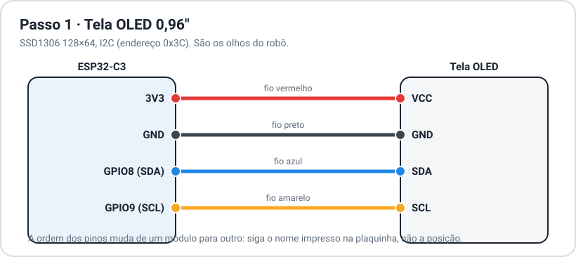
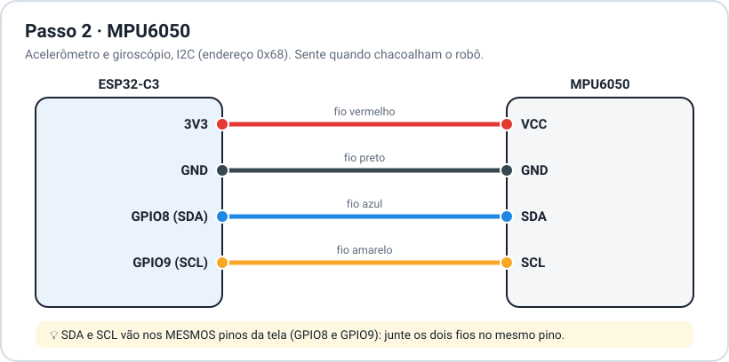
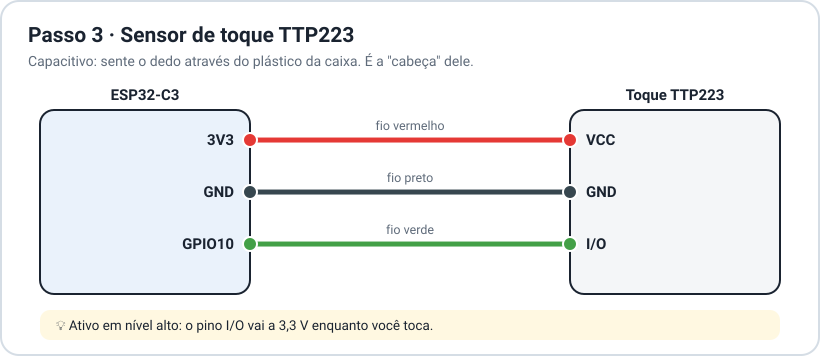
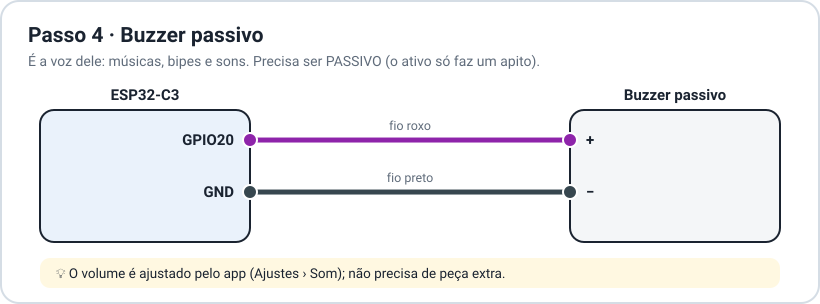
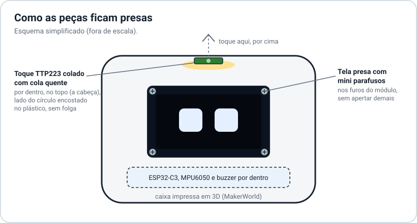

# 🔧 Manual de montagem do Ottobot

> [!IMPORTANT]
> **Os direitos de criação são do projeto original [MONSTRIX - Robot Emotional Companion](https://makerworld.com/pt/models/1941340-monstrix-robot-emotional-companion), de Igor Belyi**, que por sua vez é um remix do [LDR Little Robot](https://makerworld.com/en/models/222658), de Max Kern. Os dois são publicados no MakerWorld sob a licença [CC BY-SA](https://creativecommons.org/licenses/by-sa/4.0/deed.pt_BR). O Ottobot só aperfeiçoa o projeto: firmware novo, sensor de toque, buzzer, página web, app Android e os furos para ímãs na base.

Montagem simples: 5 peças eletrônicas ligadas por fios a um ESP32-C3, dentro da caixa impressa em 3D. Não precisa de placa nem de resistores: tudo funciona em **3,3 V**, direto nos pinos do ESP32-C3.

## 1. Peças

| | Peça | Qtd | Para quê |
|---|---|:-:|---|
| 🧠 | **ESP32-C3** (4 MB de flash, USB) | 1 | o cérebro: Wi-Fi, Bluetooth e o programa |
| 👀 | **Tela OLED 0,96"** SSD1306 128×64, I2C (4 pinos) | 1 | os olhos |
| 🫨 | **MPU6050** (acelerômetro e giroscópio, I2C) | 1 | sentir quando o chacoalham |
| 👆 | **Sensor de toque TTP223** (capacitivo) | 1 | a "cabeça": toques e carinho |
| 🔊 | **Buzzer passivo** | 1 | sons e músicas |
| 🧲 | **Ímãs de neodímio 4 × 2 mm** | 2 | na base (opcional) |
| 🖨️ | **Caixa impressa em 3D** | 1 | [modelo-3d/OttoBot.3mf](modelo-3d/README.md) |
| 🔩 | Mini parafusos | — | prender a tela pelos furos do módulo |
| 🔥 | Cola quente | — | prender o sensor de toque |
| 🔌 | Fios finos e cabo USB | — | ligações e energia |

> [!NOTE]
> O buzzer precisa ser **passivo** (sem oscilador interno). O buzzer ativo só faz um apito fixo e não toca as músicas. Dica: o passivo normalmente não tem o adesivo por cima e, ligado direto na pilha, só faz um "clique".

## 2. Mapa de pinos

| Pino do ESP32-C3 | Vai para | Fio sugerido |
|---|---|---|
| **3V3** | Tela VCC · MPU6050 VCC · Toque VCC | 🔴 vermelho |
| **GND** | Tela GND · MPU6050 GND · Toque GND · Buzzer − | ⚫ preto |
| **GPIO8** (SDA) | Tela SDA · MPU6050 SDA | 🔵 azul |
| **GPIO9** (SCL) | Tela SCL · MPU6050 SCL | 🟡 amarelo |
| **GPIO10** | Toque I/O | 🟢 verde |
| **GPIO20** | Buzzer + | 🟣 roxo |

## 3. Passo a passo das ligações

Faça uma peça de cada vez e confira antes de passar para a próxima.

### Passo 1 · Tela OLED

- 4 fios: **VCC → 3V3**, **GND → GND**, **SDA → GPIO8**, **SCL → GPIO9**.
- A ordem dos pinos varia entre módulos (alguns começam por VCC, outros por GND): **siga o nome impresso na plaquinha**, não a posição.

### Passo 2 · MPU6050

- Mesmos 4 sinais da tela. **SDA e SCL vão nos mesmos pinos** que a tela usa (GPIO8 e GPIO9): torça ou solde os dois fios juntos no mesmo pino. É assim que funciona o I2C: as duas peças conversam pelo mesmo par de fios, cada uma com seu endereço (tela 0x3C, MPU6050 0x68).
- Os outros pinos do MPU6050 (XDA, XCL, AD0, INT) ficam sem ligar.

### Passo 3 · Sensor de toque TTP223

- **VCC → 3V3**, **GND → GND**, **I/O → GPIO10**.
- Ele é capacitivo: sente o dedo **através do plástico** da caixa, não precisa ficar exposto.

### Passo 4 · Buzzer passivo

- **+ → GPIO20**, **− → GND**. Se o seu buzzer não tiver marcação, tanto faz o lado.
- O volume é ajustado pelo app (Ajustes › Som); não precisa de resistor.

> [!TIP]
> Fios curtos deixam a tela e o MPU6050 estáveis: no I2C, até uns 15 a 20 cm. Se a tela piscar ou travar, encurte os fios de SDA e SCL.

## 4. Montagem na caixa

1. **Imprima a caixa**: [modelo-3d/OttoBot.3mf](modelo-3d/README.md) (Bambu Studio ou OrcaSlicer).
2. **Tela**: presa na frente com **mini parafusos** nos furos do módulo. Aperte só até firmar: o vidro da tela trinca fácil.
3. **Sensor de toque**: colado com **cola quente**, por dentro, no topo da cabeça. O lado com o círculo (a área de toque) fica encostado no plástico, sem folga e sem bolha de cola no meio, que atrapalha a leitura.
4. **MPU6050**: prenda firme (cola quente ou fita dupla face), para ele sacudir junto com a caixa.
5. **Buzzer**: perto de uma abertura, para o som sair melhor.
6. **Ímãs** (opcional): dois ímãs de **4 × 2 mm** nos furos da base, com uma gota de cola.

> [!IMPORTANT]
> Ao ligar, **não encoste na cabeça e deixe o robô parado** por 2 segundos. Nesse momento o sensor de toque e o MPU6050 se calibram. Se você estiver tocando ou mexendo nele, o toque fica falhando ou ele acha que está sendo chacoalhado.

A imagem da tela já sai girada 180° no firmware (`setRotation(2)`), como no projeto original. A borda da caixa cobre as últimas linhas de baixo da tela; por isso os textos ficam um pouco mais para cima.

## 5. Primeiro teste

| Faça | Ele deve |
|---|---|
| Ligar no USB | mostrar a abertura OTTOBOT (letras caindo) e abrir os olhos |
| Um toque na cabeça | pular de alegria com uma musiquinha |
| Segurar a cabeça | derreter em "^ ^" com coraçõezinhos |
| Chacoalhar | ficar tonto (olhos em espiral) e depois bravo |
| Conectar no Wi-Fi **Ottobot** | abrir a página dele no celular |

## 6. Problemas comuns

| Problema | O que fazer |
|---|---|
| Tela não acende | confira 3V3 e GND; veja se SDA e SCL não estão trocados |
| Tela pisca ou trava | fios de SDA/SCL mais curtos; solda bem feita |
| Toque dispara sozinho ou não responde | religue sem encostar nele (recalibra); veja se não ficou cola entre o sensor e o plástico |
| Chacoalhar não faz nada | MPU6050 solto: prenda firme; religue com ele parado |
| Sem som | buzzer ativo no lugar do passivo; volume e "Silenciar tudo" no app (Ajustes › Som) |
| Tela apagada à noite | "Tela fraquinha à noite" com brilho muito baixo: aumente em Ajustes › Lembretes e noite |
