# 🤖 Ottobot

Um robozinho de mesa emocional: dois olhos animados numa telinha OLED, um sensor de toque na cabeça, um sensor de movimento e um buzzer. Ele tem humor, pede carinho, conta piadas, joga, canta e dança, mostra o clima, faz pomodoro com você e conversa pelo app Android com inteligência artificial.

   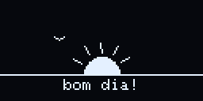

> [!IMPORTANT]
> **Os direitos de criação são do projeto original [MONSTRIX - Robot Emotional Companion](https://makerworld.com/pt/models/1941340-monstrix-robot-emotional-companion), de Igor Belyi**, que por sua vez é um remix do [LDR Little Robot](https://makerworld.com/en/models/222658), de Max Kern. Os dois são publicados no MakerWorld sob a licença [CC BY-SA](https://creativecommons.org/licenses/by-sa/4.0/deed.pt_BR). O Ottobot só aperfeiçoa o projeto: firmware novo, sensor de toque, buzzer, página web, app Android e os furos para ímãs na base.

**▶ [Veja todas as telas animadas no simulador online](https://felipeotto20.github.io/ottobot/)**: é a mesma página que o robô serve no Wi-Fi, com o simulador dos olhos.

**⬇ [Baixe a versão mais nova (firmware + app Android)](https://github.com/FelipeOtto20/ottobot/releases/latest)**

**🟦 Também existe uma versão com tela de toque colorida de 480 × 480 e o Diamond Rush original: [veja aqui](#ottobot-com-tela-480-esp32-s3)**

---

## O que ele faz

| | |
|---|---|
| 🎭 **49 telas** | caras e animações que ele sorteia sozinho (você escolhe quais no app) |
| 👄 **Boca** | uma caixinha que se transforma em cada emoção, e o rosto inteiro balança com uma molinha (item da loja) |
| 🥰 **Carinho** | segurar a cabeça dele = carinho; o "coração" esvazia com o tempo e ele fica carente |
| 🪙 **Moedas e loja** | jogos, coração cheio e conquistas dão moedas; a loja do app tem a boca, 20 acessórios e 20 músicas |
| 📋 **Menu** | 3 toques na cabeça: Jogos, Ferramentas e Acessórios |
| 🎮 **15 jogos** | jogados com toques na cabeça, chacoalhando ou inclinando ele |
| 🎩 **32 acessórios** | 12 das conquistas e 20 da loja, e eles combinam com a emoção (orelhas abaixam, auréola vira chifre, chapéu voa) |
| 🙃 **Sente o corpo** | de cabeça pra baixo = silêncio, deitado = dorme, no colo = feliz, inclinado = acha que vai cair |
| 🤝 **Amigos** | dois Ottobots perto um do outro se cumprimentam, conversam e sentem o humor um do outro |
| 🎶 **30 musiquinhas** | 10 de graça e 20 na loja, com coreografia no tempo da música |
| 🧠 **Personalidade** | muda com o jeito que você cuida dele, dia após dia |
| 📖 **Diário** | o que aconteceu em cada dia da semana, com gráfico no app |
| 🌦️ **Clima** | previsão do dia desenhada na tela, avisa quando vai chover, e o tempo muda a cara dele (calor, praia, frio, resfriado, neve) |
| 🍅 **Pomodoro** | 25 min de foco com ele quietinho, depois pausa |
| 💬 **Conversa com IA** | pelo app (Gemini grátis): ele responde e faz animações, caras e músicas |
| 📡 **Sabe quando você chega** | o app escuta o Bluetooth dele; festa quando você entra no quarto |
| ⏰ **Alarmes, cenas do dia, lembretes** | bom dia, meio-dia, boa noite, água, "como foi seu dia?" |
| 🏅 **Conquistas** | 12 medalhas, comemoradas na hora |
| 🎬 **Modo vídeo** | um show de 1 minuto para filmar |

## Telas

Cada tela é só um punhado de números (formato dos olhos, humor, para onde olham, animação que repete, efeito por cima e música). O app e a página do robô têm o catálogo; o robô só toca o que você escolheu.

<table>
<tr><td align="center"> <b>Padrão</b></td><td align="center"> <b>Feliz</b></td><td align="center"> <b>Cansado</b></td><td align="center"> <b>Bravo</b></td></tr>
<tr><td align="center"> <b>Estressado</b></td><td align="center"> <b>Desconfiado</b></td><td align="center"> <b>Sonolento</b></td><td align="center"> <b>Sapeca</b></td></tr>
<tr><td align="center"> <b>Confuso</b></td><td align="center"> <b>Rindo</b></td><td align="center"> <b>Empolgado</b></td><td align="center"> <b>Dançando</b></td></tr>
<tr><td align="center"> <b>Piscadela</b></td><td align="center"> <b>Pisca-pisca</b></td><td align="center"> <b>Curioso</b></td><td align="center"> <b>8 direções</b></td></tr>
<tr><td align="center"> <b>Com frio</b></td><td align="center"> <b>Assustado</b></td><td align="center"> <b>Olhos fofos</b></td><td align="center"> <b>Arregalado</b></td></tr>
<tr><td align="center"> <b>Olhinhos</b></td><td align="center"> <b>Espiando</b></td><td align="center"> <b>Apaixonado</b></td><td align="center"> <b>Envergonhado</b></td></tr>
<tr><td align="center"> <b>Chorando</b></td><td align="center"> <b>Cantando</b></td><td align="center"> <b>Encantado</b></td><td align="center">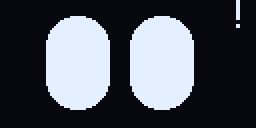 <b>Surpreso</b></td></tr>
<tr><td align="center"> <b>Pensando</b></td><td align="center"> <b>Furioso</b></td><td align="center"> <b>Tonto</b></td><td align="center"> <b>Fúria</b></td></tr>
<tr><td align="center">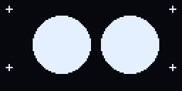 <b>Brilhando</b></td><td align="center"> <b>Oops!</b></td><td align="center"> <b>Suspeito</b></td><td align="center"> <b>Hipnotizado</b></td></tr>
<tr><td align="center"> <b>Scanner</b></td><td align="center"> <b>Festeiro</b></td><td align="center">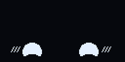 <b>Tímido</b></td><td align="center"> <b>Bugado</b></td></tr>
<tr><td align="center"> <b>Ninja</b></td><td align="center"> <b>Em pânico</b></td><td align="center"> <b>Zen</b></td><td align="center">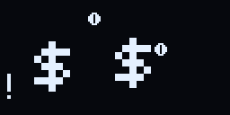 <b>Cifrão</b></td></tr>
<tr><td align="center"> <b>Olhos de estrela</b></td><td align="center">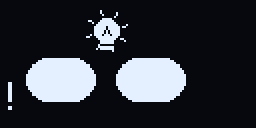 <b>Ideia!</b></td><td align="center"> <b>Nocaute</b></td><td align="center">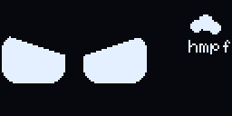 <b>Emburrado</b></td></tr>
<tr><td align="center">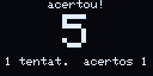 <b>Língua de fora</b></td></tr>
</table>

## Reações e cenas do dia

<table>
<tr><td align="center"> <b>Abertura (ao ligar)</b></td><td align="center"> <b>Carinho (segurar)</b></td><td align="center"> <b>Chacoalhar: tonto, depois bravo</b></td></tr>
<tr><td align="center"> <b>Sono e canção de ninar</b></td><td align="center"> <b>Wi-Fi conectou</b></td><td align="center">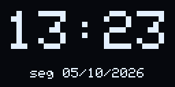 <b>Relógio</b></td></tr>
<tr><td align="center"> <b>Bom dia</b></td><td align="center">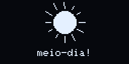 <b>Meio-dia</b></td><td align="center">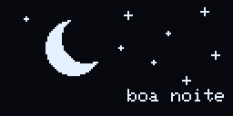 <b>Boa noite</b></td></tr>
</table>

- **Toques rápidos**: cada quantidade (1 a 8 toques) faz o que você escolher no app. Padrão: 1 = alegria, 2 = dança, 3 = menu, 5 = hora, 6 = QR code da página.
- **Segurar**: carinho. Quanto mais tempo, mais derretido: "^ ^", olhos de coração, nas nuvens (com brilhos e notinhas).
- **Chacoalhar** (balançar pros lados várias vezes; um tranco ou deitar não conta): fica tonto (olhos em espiral) e depois bravo e suando. Duas vezes seguidas: **nocaute** (olhos em X, estrelinhas girando e o chapéu voa).
- **Sono**: dorme depois de um tempo parado, só à noite ou nunca. Dormindo, um toque canta canção de ninar e 3 toques rápidos acordam.

## Boca, clima no rosto e acessórios

Gravados direto da tela do robô.

<table>
<tr><td align="center" width="33%"> <b>👄 Boca</b> canta, fala, sorri, fica triste, bravo, faz "o" e mostra a língua; o rosto balança com uma molinha</td><td align="center" width="33%">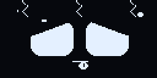 <b>🌡️ Clima no rosto</b> calor, praia, frio, resfriado (atchim!) e neve: só quando o tempo pede</td><td align="center" width="33%"> <b>🎩 Acessórios que sentem</b> a nuvem vira sol ou chove forte, orelhas abaixam, auréola vira chifre, o chapéu voa no nocaute</td></tr>
</table>

- **Boca** (comprada na loja, liga e desliga no app): uma caixinha que muda de tamanho e escorrega de uma forma para outra, com pontinhas que sobem no sorriso e descem na tristeza. Ela segue tudo: o humor dos olhos, cada nota que toca, as falas, o sono, o susto e o carinho.
- **Clima no rosto**: as caras de clima não entram no rodízio de telas. O tempo traz elas: quente = calor e às vezes praia (com óculos escuros), frio = congelando e às vezes resfriado, nevando = neve (com gorro e cachecol). A IA do app comenta.
- **Emoções novas**: cifrão (quando ganha moedas), olhos de estrela, ideia (a lâmpada acende quando ele chama para brincar), nocaute, emburrado ("hmpf") e língua de fora.

## Moedas e loja

- **Ganhar**: jogos (até 20 moedas por partida e +10 ao bater um recorde, até 150 por dia), coração cheio com carinho (+30, uma vez por dia) e cada conquista (+50). Ele faz olhos de cifrão quando ganha.
- **Loja** (aba Loja do app): a boca (800), 20 acessórios de 250 a 1200 (tapa-olho de pirata, bruxa, viking, astronauta, nuvem de chuva, sobrancelhas que mudam com o humor, bigode, herói...) e 20 músicas clássicas de 150 a 350. Dá para provar no robô antes de comprar, e tudo fica salvo nele.
- **Caça-níquel** aposta 10 moedas de verdade: 7 7 7 paga 350 (raro!), trios de 30 a 120, dois 7 = 50, outro par = 12, um 7 sozinho devolve a aposta.

## Menu, acessórios e gestos

<table>
<tr><td align="center" width="33%"> <b>📋 Menu</b> 3 toques abrem; toque desce, segure até apitar e solte para escolher</td><td align="center" width="33%">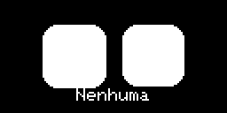 <b>🎩 Acessórios</b> experimente no rosto dele; os trancados mostram a medalha que libera</td><td align="center" width="33%">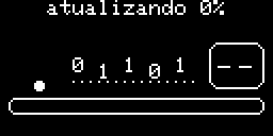 <b>📡 Atualizando</b> a tela durante uma atualização pelo Wi-Fi</td></tr>
</table>

- **Menu** (3 toques, dá para trocar no app): **Jogos** (com o seu recorde embaixo de cada um), **Ferramentas** (relógio, cronômetro, pomodoro, clima, dado), **Acessórios** (os das conquistas e os comprados) e **Sair**. Quando um jogo acaba ele volta para o rostinho.
- **De cabeça pra baixo** (1,5 s): liga ou desliga o silêncio.
- **Deitado de lado** (3 s): boceja e dorme; em pé de novo, acorda.
- **No colo** depois de um tempo parado: olha pra você feliz, com coraçõezinhos.
- **Inclinado pro lado**: acha que vai cair. Olhos arregalados e tremendo escorregam para o lado mais baixo, ele grita e as letras do grito caem com a gravidade. Reto de novo: "ufa!".
- **Amigos**: dois Ottobots no mesmo Wi-Fi (ou os dois sem Wi-Fi de casa) se falam por ESP-NOW. Eles se cumprimentam ("oi, robô do Fulano!"), de vez em quando um pergunta e o outro responde, e um sente o humor do outro: carinho vira coraçõezinhos, chacoalhão vira "tudo bem?", sono vira bocejo.

## Mais animações

Também gravadas direto da tela do robô.

<table>
<tr><td align="center" width="33%"> <b>✨ Abertura</b> com a contagem 3-2-1 do modo vídeo</td><td align="center" width="33%"> <b>🤡 Piada</b> pergunta, suspense, susto ou espanto e gargalhada</td><td align="center" width="33%"> <b>🎉 Festa de chegada</b> quando você entra no quarto</td></tr>
<tr><td align="center" width="33%">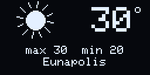 <b>🌦️ Clima</b> previsão do dia e o comentário dele</td><td align="center" width="33%">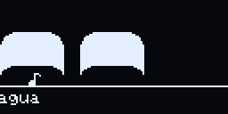 <b>🎶 Música com coreografia</b> dança no tempo de cada batida</td><td align="center" width="33%">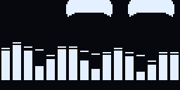 <b>🎧 Modo música</b> dança e mostra as frequências da música do celular</td></tr>
<tr><td align="center" width="33%">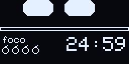 <b>🍅 Pomodoro</b> foco de 25 min com ele concentrado</td><td align="center" width="33%">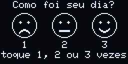 <b>🙂 Como foi seu dia?</b> responde com 1, 2 ou 3 toques</td><td align="center" width="33%">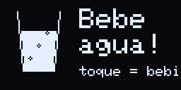 <b>💧 Lembrete de água</b> um toque = bebi</td></tr>
<tr><td align="center" width="33%">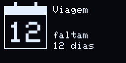 <b>📅 Contagem regressiva</b> dias que faltam para uma data</td><td align="center" width="33%"> <b>🔳 QR code</b> abre a página dele no celular</td><td align="center" width="33%">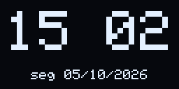 <b>🕒 Relógio</b> hora grande e data</td></tr>
<tr><td align="center" width="33%"> <b>🥰 Carinho</b> coraçõezinhos e bochechas coradas</td><td align="center" width="33%">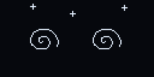 <b>😵 Tonto e bravo</b> depois de um chacoalhão</td></tr>
</table>

## Carinho, humor e personalidade

- O **coração** vai de 0 a 100%: carinho e toques enchem, o tempo e chacoalhões esvaziam. Abaixo de 30% ele fica **carente**: coração vazio, pede carinho e **não obedece** ninguém até ganhar um carinho longo. Abaixo de 10% ele chora. O "modo carente" pode ser desligado.
- **Personalidade**: todo dia o dia anterior empurra um pouco. Muito carinho deixa ele **carinhoso** (o coração esvazia mais devagar e ele diz que gosta de você); muitos jogos e toques, **brincalhão** (chama para jogar); esquecido fica **carente**; dias quietos, **calmo**.
- **Diário**: carinhos, tempo de carinho, toques, jogos, piadas, pomodoros, copos de água, humor do dia e coração médio, 7 dias.
- **Piadas**: ele encena (pergunta, suspense, susto ou espanto, risada). Ele guarda 20; a IA do app troca as já contadas por novas, com trocadilhos que funcionam em português, e uma segunda IA faz de crítica e só deixa passar as boas. 3 vezes por dia ele conta uma quando você está no quarto.

## Mini jogos

Gravados direto da tela do robô.

<table>
<tr><td align="center" width="33%">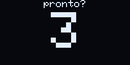 <b>⚡ Reflexo</b> 3, 2, 1… toque quando aparecer o !</td><td align="center" width="33%">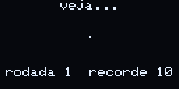 <b>🎶 Genius</b> Repita: toque = curto, segure = longo</td><td align="center" width="33%">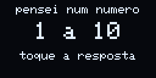 <b>🔢 Adivinha</b> Ele pensou de 1 a 10: responda com toques</td></tr>
<tr><td align="center" width="33%">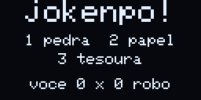 <b>✊ Jokenpô</b> 1 toque pedra, 2 papel, 3 tesoura</td><td align="center" width="33%">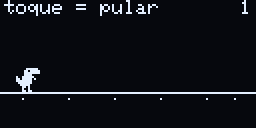 <b>🦖 Dino</b> Pule cactos e aves baixas; ave alta: fique no chão</td><td align="center" width="33%">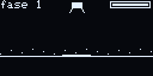 <b>🌙 Pouso</b> Segure para ligar o motor e pouse devagar</td></tr>
<tr><td align="center" width="33%">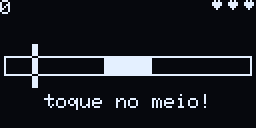 <b>🎯 Alvo</b> Toque quando a barra estiver no meio</td><td align="center" width="33%">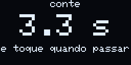 <b>⏱️ Cronômetro</b> Conte o tempo de cabeça e toque quando passar</td><td align="center" width="33%">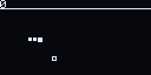 <b>🐍 Snake</b> Toque = vira à direita, segure = à esquerda</td></tr>
<tr><td align="center" width="33%">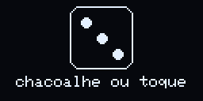 <b>🎲 Dado</b> Chacoalhe ou toque para jogar o dado</td><td align="center" width="33%">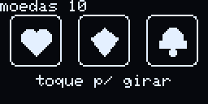 <b>🎰 Caça-níquel</b> Aposta 10 moedas: 7 7 7 = 350, trios 30 a 120, par 12</td><td align="center" width="33%">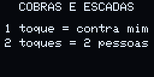 <b>🪜 Cobras e escadas</b> 1 toque: contra ele · 2 toques: duas pessoas · depois toque = dado</td></tr>
<tr><td align="center" width="33%"> <b>🐦 Flappy</b> Toque para bater as asas e passe entre os canos</td><td align="center" width="33%"> <b>🧱 Torre</b> Toque para soltar o bloco bem em cima da torre</td><td align="center" width="33%"><b>🌀 Labirinto</b> Incline o robô para rolar a bolinha até o buraco, contra o tempo; cada fase é um labirinto maior</td></tr>
</table>

Durante um jogo nada mais funciona (comandos, cenas, chacoalhar). **Segure a cabeça 3 s para sair** (aparece a dica e uma barrinha; no Pouso segurar é o motor, então ele sai quando a nave bate). Perdeu: **GAME OVER** e volta para o rostinho; nenhum jogo recomeça sozinho. 10 s sem jogar, ele sai. Os recordes ficam salvos e as partidas dão moedas.

## Musiquinhas e dança

| | Música | Duração |
|---|---|---|
| 🤖 | Ottobot vibes | 0:20 |
| 🎹 | Para Elisa | 0:12 |
| 🎂 | Parabéns pra você | 0:18 |
| ⭐ | Brilha, brilha | 0:27 |
| 🎻 | Ode à alegria | 0:33 |
| 🦾 | Marcha do robô | 0:36 |
| ✨ | Chuva de estrelas | 0:43 |
| ⛰️ | Rei da montanha | 0:46 |
| 🌙 | Soninho | 0:48 |
| 🎉 | Festa 8-bit | 0:51 |

Mais 20 na loja do app, todas de domínio público: Bate o sino, Noite feliz, Cancan, Marcha turca, Danúbio azul, Lago dos cisnes, Guilherme Tell, The Entertainer, Canon em Ré, Frère Jacques, La cucaracha, Os santos, Greensleeves, Marcha nupcial, Oh! Susana, Ninar de Brahms, Pequena serenata, Minueto em Sol, Rema rema e Primavera.

A coreografia é calculada no app para o tempo exato de cada batida e o robô dança no mesmo relógio da música: pulinhos no tempo forte, olhos seguindo a melodia (nota aguda olha para cima), giros, piscadas, olhos crescendo, efeitos que trocam a cada 2 compassos e olhos de coração no fim. Também tem **modo música**: o celular escuta a música que está tocando (pelo microfone) e ele dança mostrando as frequências. Volume do bipe ajustável no app.

## Companhia no dia a dia

- 🌦️ **Clima** (só no Wi-Fi de casa): [Open-Meteo](https://open-meteo.com/), sem chave. Cidade escolhida no app ou descoberta pela internet. Mostra de manhã, quando vai chover e umas 2 vezes por dia. Em dia quente ele fica com calor (e às vezes sonha com a praia), no frio treme (e às vezes pega um resfriado), e com neve olha os flocos caindo.
- 🍅 **Pomodoro**: 25 min de foco (ele fica quieto e concentrado; um toque dá um incentivo), 5 min de pausa (15 a cada 4 rodadas) e depois chama você de volta.
- 🙂 **"Como foi seu dia?"** à noite, respondido com 1, 2 ou 3 toques. 💧 **Lembrete de água** durante o dia, um toque = bebi.
- 📅 **Contagem regressiva** para datas marcadas no app (prova, viagem, aniversário), com festa no dia.
- ⏰ **Alarmes** com dias da semana e soneca. 🌅 **Cenas do dia** em horários escolhidos. 🔇 **Silêncio** total ou em horários. 🌙 **Tela fraquinha à noite**.
- Tudo que é para ler (perguntas, lembretes, medalhas, datas, clima) **espera você estar perto**: celular no quarto (Bluetooth) ou logo depois de um toque.

### Conquistas

Cada medalha libera um acessório (menu → Acessórios) e dá 50 moedas.

🐻 **Abraço de urso**: um carinho longo, até ele ficar nas nuvens (uns 18 s segurando) → libera: orelhas de urso  
❤️ **Coração cheio**: encher o carinho dele até 100% → libera: laço  
📅 **Semana de carinho**: carinho nele 7 dias seguidos → libera: coroa  
🍅 **Foco de aço**: completar 10 pomodoros → libera: óculos  
📚 **Dia produtivo**: 4 pomodoros no mesmo dia → libera: faixa  
💧 **Hidratado**: 8 copos de água num dia (toque nele quando ele lembrar) → libera: boné  
🤡 **Plateia fiel**: ouvir 30 piadas dele → libera: nariz de palhaço  
🦖 **Dino veloz**: 500 pontos no Dino → libera: óculos escuros  
🎶 **Memória boa**: chegar na rodada 8 do Genius → libera: chapéu de mago  
⚡ **Rápido como raio**: reflexo abaixo de 250 ms → libera: fones  
📖 **Diário em dia**: contar como foi seu dia 5 vezes → libera: cartola  
🌟 **Dia completo**: no mesmo dia: carinho, jogo, pomodoro e água → libera: auréola

## App Android

- **Início**: o rosto dele ao vivo, coração, atalhos, foco, musiquinhas, modo vídeo, jogos, diário, personalidade, conquistas, datas, cenas, caras e recado na telinha.
- **Conversa**: IA grátis ([chave do Gemini](https://aistudio.google.com/apikey), fica só no celular). Ele responde em frases curtas, escolhe animações, inventa caras e músicas e reage quando você faz carinho nele.
- **Loja**: moedas, a boca, acessórios e músicas para provar e comprar, e escolher o que ele usa.
- **Perto**: radar do Bluetooth, festa quando você chega, aviso quando ele está carente, 3 piadas por dia.
- **Ajustes**: tudo do robô (telas, toques, horários, sono, som, Wi-Fi, senha, lembretes, clima) e as atualizações, com as etapas e a porcentagem na tela.

Instale pelo arquivo `ottobot.apk` da [última versão](https://github.com/FelipeOtto20/ottobot/releases/latest) ou pela página do robô (`http://ottobot.local`). Android 12 ou mais novo. Quando sai uma versão nova aqui, o app avisa e atualiza o robô e ele mesmo.

## Ottobot com tela 480 (ESP32-S3)

Uma segunda versão do Ottobot, numa placa pronta com tela colorida de toque: **GUITION ESP32-4848S040** (ESP32-S3, 16 MB de flash, 8 MB de PSRAM, tela ST7701 de 480 × 480 com toque GT911). É o mesmo Ottobot do OLED (emoções, reações, cenas, acessórios, moedas, loja, app e IA), com o rosto na tela grande e tudo comandado pelo toque na própria tela. Não precisa montar nada: a placa já vem com tela, toque e Wi-Fi.

**Como funciona**

- O rosto é o mesmo do OLED, ampliado no meio da tela. Tocar na tela é como tocar na cabeça dele: carinho, toques contados e jogos.
- O botão **≡** no canto de cima abre o menu tocável: toque num item para abrir; **Anterior** e **Próximo** trocam de página.
- A rede própria se chama **Ottobot-480** (senha inicial `ottobot1`) e a página é `http://ottobot-480.local` (só Wi-Fi e download do app; os comandos ficam no app).
- O app reconhece a placa sozinho e cuida de dois robôs (um OLED e um 480): **Ajustes › Cadastrar outro robô** e o botão **Robôs** na tela inicial.

**Diferenças e exceções**

| | OLED (ESP32-C3) | Tela 480 (ESP32-S3) |
|---|---|---|
| Toque | sensor na cabeça | a tela inteira, com botões |
| Sensor de movimento (MPU6050) | vem montado | opcional (I2C SDA 19 / SCL 45) |
| Sem o sensor de movimento | — | Batatinha frita sai do menu e do app; Labirinto, Snake, Corrida, Pouso e Diamantes mostram setas na tela |
| Som | buzzer | desligado por padrão |
| Jogos de toques contados | conta os toques | botões na tela: Jokenpô (Pedra, Papel, Tesoura), Adivinha (1 a 10), Genius (Curto, Longo) |
| Mini jogos | telinha 128 × 64 | tela inteira, coloridos e animados (Flappy com céu e canos, Dino de dia e de noite, Snake, Torre, Corrida, Caça-níquel, Jokenpô, Genius, Adivinha, Reflexo, Alvo, Tempo, Pouso na lua, Labirinto, Diamantes, Dado, Cronômetro e Cobras e escadas com escadas de madeira e cobras com olhos) |
| Rosto e animações | pixels da tela OLED | os mesmos, com bordas suavizadas, degradê azul e brilho, sem piscar |
| Menu | toque desce, segurar escolhe | itens tocáveis; Anterior e Próximo só quando há outra página |
| Brilho | — | 100% de dia, 70% à noite |
| Atualizações | pelo app (estas versões do GitHub) | pelo cabo USB; o app nunca oferece o firmware do OLED para ela |

**Exclusivo da tela 480: Diamond Rush**

O clássico de celular da Gameloft (2006) rodando o jogo Java original dentro da própria placa, numa máquina virtual Java ([Flint JVM](https://github.com/FlintVN/FlintESPJVM)) com a camada de jogos de celular do [ESP32-J2ME](https://github.com/bbnmn4800/ESP32-J2ME). O celular não é preciso: os 3 mundos (40 fases) e o progresso ficam na placa.

- Abre pelo menu **Jogos › Diamond Rush** ou pela lista de jogos do app (só aparece para a tela 480).
- Controle na tela: setas, **A** (ação), **B** (menu), **★** (voltar ao checkpoint); os cantos de baixo da imagem são o **Skip/OK** e o **voltar** do jogo. O controle do app também funciona (X = checkpoint).
- O botão **≡** no canto abre **CONTROLES** (mostra ou esconde o controle) e **SAIR** (volta ao Ottobot). A opção de sair do menu do jogo também volta, e qualquer reinício cai no Ottobot.
- Cada fase vencida pela primeira vez dá moedas para o Ottobot, fora do limite diário dos jogos: **Angkor** 50 a 350, **Baviera** 150 a 630, **Tibete** 300 a 1080 (17.330 no jogo todo). Elas entram quando você volta para ele, com os olhos de cifrão.
- O arquivo do jogo é da Gameloft e não é distribuído aqui.

## Hardware e montagem

**🔧 [Manual de montagem completo](MONTAGEM.md)**: peças, passo a passo das ligações com desenhos, como prender na caixa e problemas comuns.

**🖨️ [Modelo 3D (OttoBot.3mf)](modelo-3d/README.md)**: a caixa do MONSTRIX com furos para ímãs de 4 × 2 mm na base.

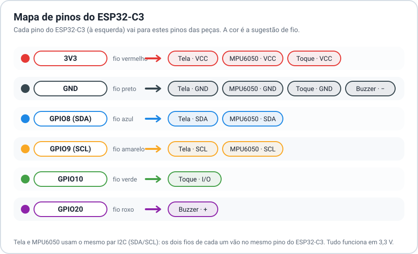

| Peça | Pino do ESP32-C3 |
|---|---|
| Tela OLED 0,96" SSD1306 (I2C 0x3C) | SDA → GPIO8, SCL → GPIO9 |
| MPU6050 (I2C 0x68) | SDA → GPIO8, SCL → GPIO9 (mesmos da tela) |
| Sensor de toque TTP223 | I/O → GPIO10 (colado com cola quente por dentro da cabeça) |
| Buzzer passivo | + → GPIO20 |
| Todos | VCC → 3V3, GND → GND |

A tela fica presa com mini parafusos.

Bibliotecas: Adafruit SSD1306 e GFX, [FluxGarage RoboEyes](https://github.com/FluxGarage/RoboEyes) 1.1.1, MPU6050_light. Placa: ESP32 core 3.3, partição "Minimal SPIFFS (com OTA)".

## Conectar

1. Conecte o celular no Wi-Fi **Ottobot** (senha padrão `ottobot1`; troque no app) e a página abre sozinha, ou abra `http://192.168.4.1`.
2. Pela página ou pelo app, coloque o robô no Wi-Fi de casa: aí é só abrir `http://ottobot.local` sem sair da sua internet.

Para quem quiser mexer, o robô tem uma API HTTP simples: `/api/state`, `/api/config`, `/api/do`, `/api/show`, `/api/say`, `/api/song`, `/api/diary`, `/api/jokes`, `/api/buy`, `/api/update`.

## Créditos e direitos

- **Projeto original e direitos de criação**: [MONSTRIX - Robot Emotional Companion](https://makerworld.com/pt/models/1941340-monstrix-robot-emotional-companion), de **Igor Belyi**, remix do [LDR Little Robot](https://makerworld.com/en/models/222658), de **Max Kern** (MakerWorld, CC BY-SA). O Ottobot é um aperfeiçoamento desse projeto.
- Olhos animados pela biblioteca [RoboEyes](https://github.com/FluxGarage/RoboEyes), da FluxGarage.
- Tela 480: [Arduino_GFX](https://github.com/moononournation/Arduino_GFX); Diamond Rush pela [Flint JVM](https://github.com/FlintVN/FlintESPJVM) e pelo [ESP32-J2ME](https://github.com/bbnmn4800/ESP32-J2ME) (MIT). Diamond Rush © Gameloft.
- Clima do [Open-Meteo](https://open-meteo.com/); localização aproximada do ip-api.com.
