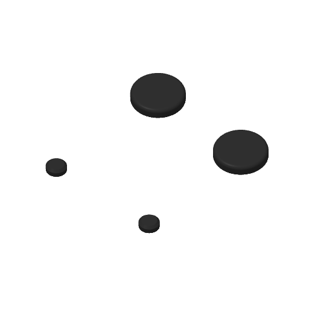
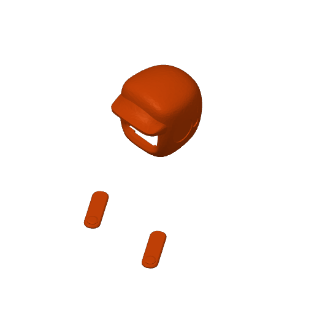
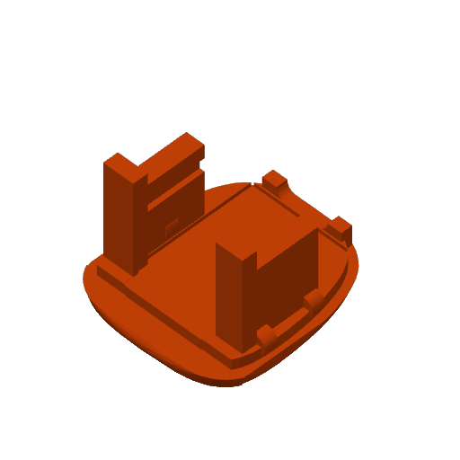

# 🖨️ Modelo 3D do Ottobot

> [!IMPORTANT]
> **Os direitos de criação são do projeto original [MONSTRIX - Robot Emotional Companion](https://makerworld.com/pt/models/1941340-monstrix-robot-emotional-companion), de Igor Belyi**, que por sua vez é um remix do [LDR Little Robot](https://makerworld.com/en/models/222658), de Max Kern. Os dois são publicados no MakerWorld sob a licença [CC BY-SA](https://creativecommons.org/licenses/by-sa/4.0/deed.pt_BR). O Ottobot só aperfeiçoa o projeto: firmware novo, sensor de toque, buzzer, página web, app Android e os furos para ímãs na base.

Arquivo: **[OttoBot.3mf](OttoBot.3mf)**. Abre no Bambu Studio ou no OrcaSlicer, já separado em placas.

| Placa 1 · tampas das orelhas | Placa 2 · cabeça e orelhas | Placa 3 · base com furos para ímãs |
|:-:|:-:|:-:|
|  |  |  |

## O que mudou em relação ao MONSTRIX

- **Base com 2 furos para ímãs de neodímio de 4 × 2 mm** (4 mm de diâmetro, 2 mm de altura).

## Impressão

- PLA. O arquivo já vem com o perfil de impressão (Bambu Lab A1 mini); em outras impressoras é só trocar a impressora no fatiador.
- Duas cores, como no original: corpo laranja e tampas das orelhas pretas.
- Os ímãs entram depois de impresso, com uma gota de cola.

## Licença

Este modelo é derivado de obras sob [CC BY-SA 4.0](https://creativecommons.org/licenses/by-sa/4.0/deed.pt_BR) e segue a mesma licença: pode usar, imprimir e modificar, **dando crédito** aos autores (Max Kern → Igor Belyi → Ottobot) e **compartilhando suas versões com a mesma licença**.
